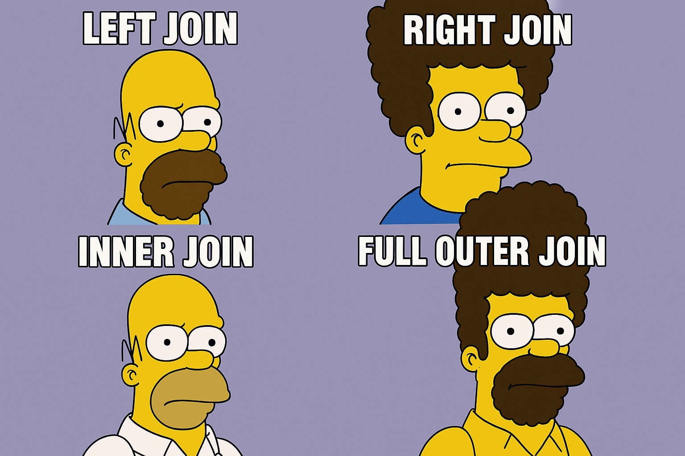

# Journal — 2025-09-20 — Data Engineering Day 2

## 1) What I learned (bullets, not prose)
- During presentation we should start on data pipelines building. Talk about the flow or data mapping- movement of data
- Why we are using DBeaver? So that we can observe the flow of the pipeline
- Engine= Memory- temporary, once shutdown or restarted- data is wipe out
- Chinook Database- sample database, widely use
- SQL- bridge business questions and data
- Normalization is a series of safety checks
- NORMALIZATION is not part of transformation process. 

## 2) New vocabulary (define in your own words)
- Data Modelling- how data is structured
https://www.ibm.com/think/topics/data-modeling

## 3) Data Engineering mindset applied (what principles did I use?)
- Small changes: atomic commits; test + verify.

## 4) Decisions & assumptions (why, alternatives, trade-offs)
- Pipeline Building Approach: Raw → Clean → Mart

- Why? Ensures data quality by staging transformations.

- Alternatives? Direct ingestion → marts (faster, less control).

- Trade-offs: More steps = more clarity and reusability, but longer development cycle.

## 5) Open questions (things I still don’t get)
- At what point do I know it’s time to re-model versus just patch or add new tables?
- How do I join tables?
- What is data modelling? 
- When to star schema?
- Dim and Fact tables?

## 6) Next actions (small, doable steps)
- Study SQL 

## 7) Artifacts & links (code, queries, dashboards)
- 

---

### Mini reflection (3–5 sentences)
What surprised me? What would I do differently next time? What will I watch out for in production? 

I was suprised by how much clarity I got from breaking the pipeline into raw--->clean--->mart instead of trying to process everything at once. During the first session, I was so lost onto what to do next. Now, I can visualize the process on my head, not yet cleary but atleast. I also realized the importance of knowing when to use a view versus a saved table. I have to alot plenty of time studying and understand SQL query. 

### BONUS: What is a meme that best describes what you feel or your learning today?

