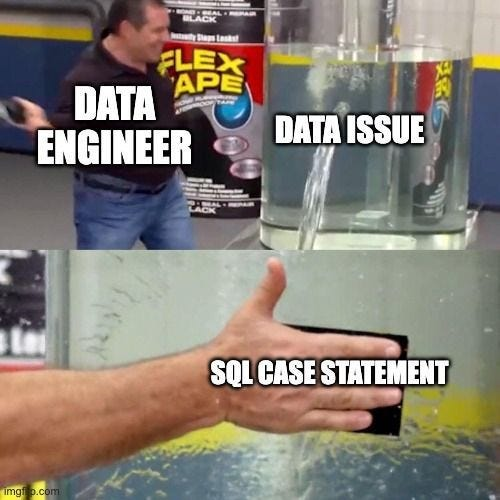

🚀 # Journal — 2025-09-27 — Data Engineering Day 3 🚀

## 1) What I learned (bullets, not prose) ⚡

- If you normalized you make sure data integrity is maintained. 
- The more errors you encountered along the way the better. 
- Snowflake model is a connection between dimension table to another dimension table. 
- Star Schema is a connection between dimension table and fact table. 
- In categorization do not duplicate data. 
- Always check rows, counts, outliers etc (at stage). 

## 2) New vocabulary (define in your own words) 🅰️

- SST Single Source of Truth- one central source that acts as the most accurate and up-to-date record for a system. It acts as the master copy. 

## 3) Data Engineering mindset applied (what principles did I use?)

- Small changes: atomic commits; test + verify.

## 4) Decisions & assumptions (why, alternatives, trade-offs) 🏆

- Treat errors as signals of issues in raw data or pipeline.
- Early detection helps clean, validate, and strengthen trust is dataset. 
- Fixing early is time consuming but ensuress quality; ignoring saves time short-term but creates a bigger downstream issues. 

## 5) Open questions (things I still don’t get) 😕

- Even after some practice, I still find certain parts of data modelling hard to fully grasp. I struggle with how to properly design fact and dimension tables so they connect smoothly without resulting to redundancy or confusion. I also get stuck on writing more advanced SQL queries, especially when joining multiple tables or applying more complex aggregations. Sometimes I'm unsure whether my logic is really giving the right results, or if I'm just forcing the query to run. I still get lost on where should I start when it comes to extracting datasets. 

## 6) Next actions (small, doable steps) ⏰

- Time management
- Include one SQL DataCamp Course in my daily Schedule

📖 ## 7) Artifacts & links (code, queries, dashboards)

https://www.hackerrank.com/domains/sql

### Mini reflection (3–5 sentences) 🎊
What surprised me? What would I do differently next time? What will I watch out for in production? 

What surprised me the most was how much schema design and normalization affect both performance and data integrity. I also realized that the errors I encountered early on were actually helpful because they pushed me to clean and validate the data more thoroughly. Next time, I would spend more effort planning the schema and documenting my trade-offs before jumping into the build. In production, I’ll be extra careful with validation by checking row counts, duplicates, and outliers early in the pipeline. I’ll also watch out for performance issues from complex join. 

### BONUS: What is a meme that best describes what you feel or your learning today?

