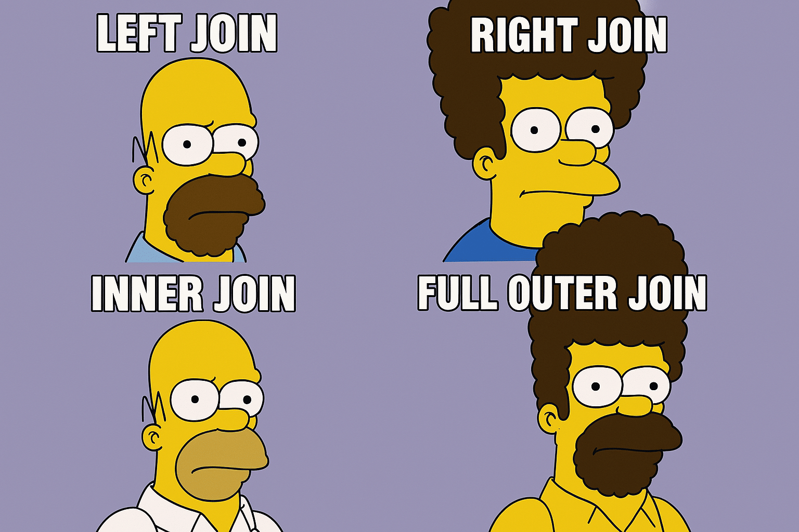
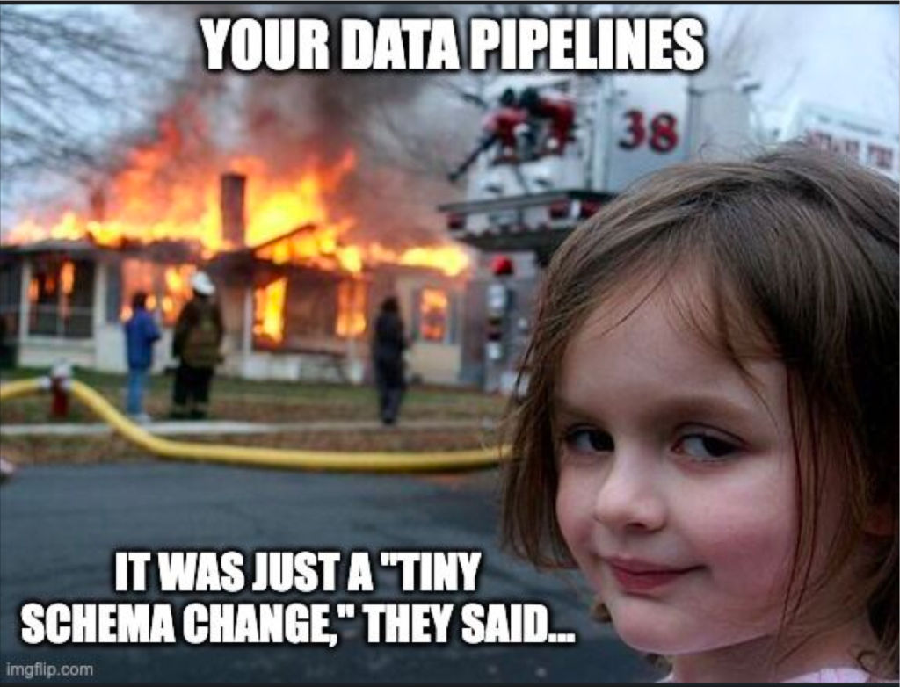

# Journal — 2025-09-20 — Data Engineering Day 3

## 1) What I learned (bullets, not prose)

## 2) New vocabulary (define in your own words)

## 3) Data Engineering mindset applied (what principles did I use?)
- Small changes: atomic commits; test + verify.

## 4) Decisions & assumptions (why, alternatives, trade-offs)

## 5) Open questions (things I still don’t get)

## 6) Next actions (small, doable steps)
 

## 7) Artifacts & links (code, queries, dashboards)

### Mini reflection (3–5 sentences)
What surprised me? What would I do differently next time? What will I watch out for in production? 

### BONUS: What is a meme that best describes what you feel or your learning today?

