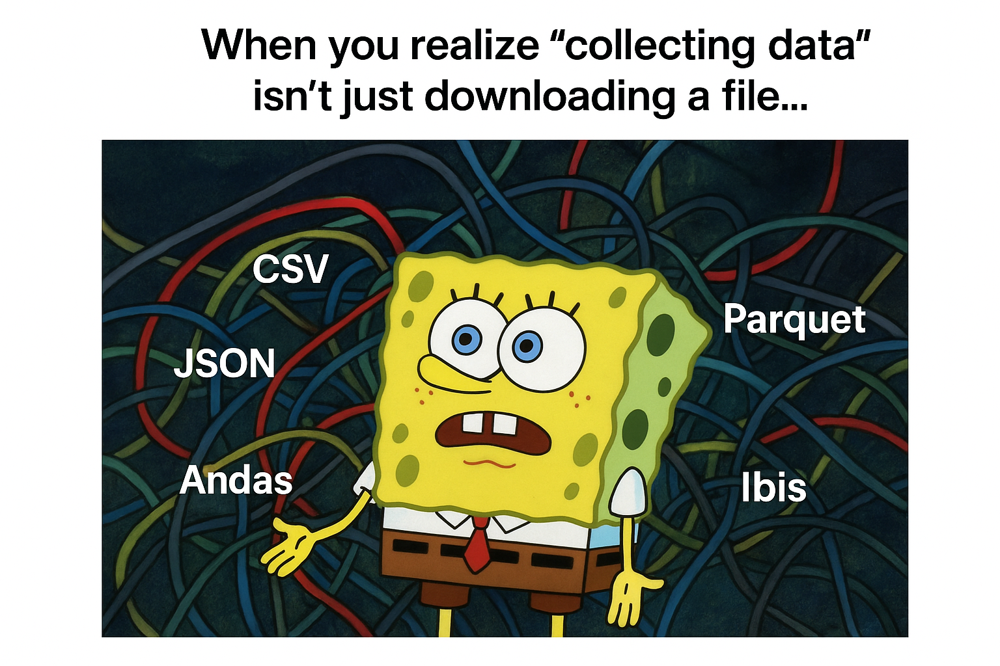

# ❤️‍🔥 Journal — 2025-10-11 — Data Engineering Day 5

## 🔥 1) What I learned (bullets, not prose)

- Data moves through a life cycle: from collection → storage → transformation → serving → visualization.
- Data pipelines evolve from raw → clean → mart, supporting scalability and analytics.
- Different data shapes (tabular, hierarchical, graph, time-series, geospatial) suit different use cases.
- Data types (primitive, temporal, categorical, missing) define semantics — “every column has meaning beyond its name.”
- File formats have trade-offs — pick based on use case, not convenience:
- CSV/JSON for sharing
- Parquet/ORC for analytics
- Pandas is great for in-memory data manipulation; Ibis connects to large-scale backends (DuckDB, Snowflake, BigQuery).
- APIs are a modern, structured way of collecting external data — use GET, POST, and handle rate limits & pagination.
- Web scraping is for sites without APIs — requires HTML parsing (BeautifulSoup) or dynamic rendering (Playwright).
- Data ethics — collecting data responsibly and with consent is as important as technical skill.

## 🔥 2) New vocabulary (define in your own words)

- Ibis – a Python library that builds query “recipes” and translates them to SQL for various databases.
- Parquet – a columnar storage format optimized for compression and analytical queries.
- API (Application Programming Interface) – a structured way for software systems to communicate.
- User-Agent – a browser or client identifier sent in HTTP requests so the server knows who’s requesting data.
- Pagination – splitting large API results into smaller pages to avoid overload.
- BeautifulSoup – a Python library for parsing HTML and extracting data from web pages.
- Deferred Execution – building a plan of operations that only executes when needed (used by Ibis).

## 🔥 3) Data Engineering mindset applied (what principles did I use?)

- Modularity and flow: building pipelines that move data through stages systematically (raw → clean → mart).
- Efficiency and scalability: using tools like Ibis for large datasets instead of Pandas.
- Ethical responsibility: collecting and processing data only when appropriate and with consent.

## 🔥 4) Decisions & assumptions (why, alternatives, trade-offs)

- Decision: Learn both Pandas and Ibis.
    Why: Pandas is perfect for small datasets, Ibis scales to production systems.
    Alternative: Only use Pandas — easier but not scalable.
    Trade-off: Pandas is faster to start, Ibis prepares me for real-world large-scale data.

- Decision: Use JSON for APIs, Parquet for analytics.
    Why: JSON is universal for exchange, Parquet is efficient for querying.
    Alternative: CSV for everything — but too large and inefficient.

## 🔥 5) Open questions (things I still don’t get)

- How do you handle schema evolution in pipelines (e.g., when new fields appear in APIs)?
- When is it best to store vs. stream data?
- How can I automate data quality checks at the ingestion stage?
- How does Ibis compare to dbt for transformation logic?

## 🔥 6) Next actions (small, doable steps)

- Practice ingesting JSON data and flattening it into a DataFrame.
- Try using Ibis to connect to DuckDB or SQLite.
- Build a small data pipeline from raw CSV → clean table → dashboard.

## 🔥 7) Artifacts & links (code, queries, dashboards)

📁 Code Snippets (Docs & References)
- pandas.read_json() → https://pandas.pydata.org/pandas-docs/stable/reference/api/pandas.read_json.html
- pandas.json_normalize() → https://pandas.pydata.org/pandas-docs/stable/reference/api/pandas.json_normalize.html
- ibis.connect() → https://ibis-project.org/docs/latest/

🔗 Official Documentation

- Pandas Documentation → https://pandas.pydata.org/
- Ibis Framework → https://ibis-project.org/docs/latest/
- BeautifulSoup Docs → https://beautiful-soup-4.readthedocs.io/
- Playwright Python → https://playwright.dev/python/

### Mini reflection (3–5 sentences)
What surprised me? What would I do differently next time? What will I watch out for in production? 

▶️ Today deepened my understanding of how data travels from the real world into analytics systems. I learned that the choice of data format, tool, and structure directly impacts performance and scalability. The most valuable takeaway was that a data engineer’s role is not just technical but also ethical — handling data responsibly. Understanding how Pandas, Ibis, and APIs work together made the abstract data flow much more tangible.

### BONUS: What is a meme that best describes what you feel or your learning today?

